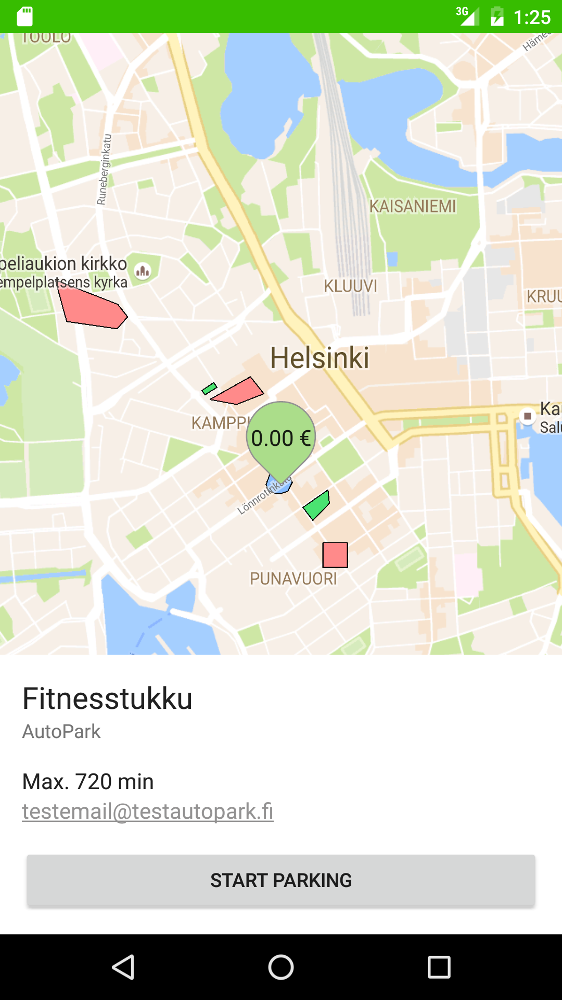
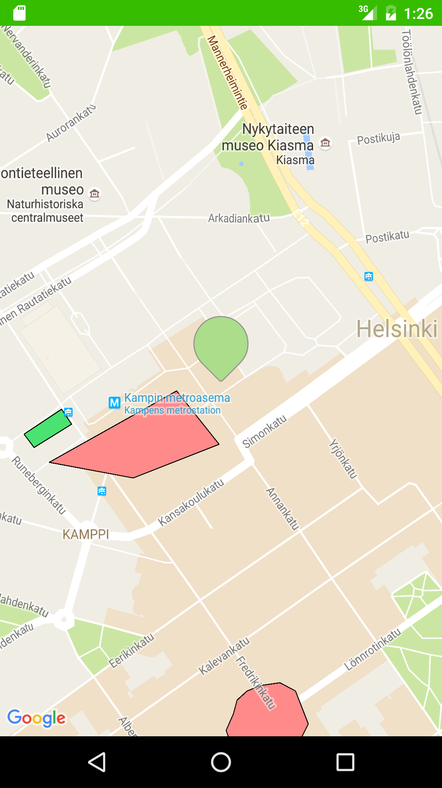
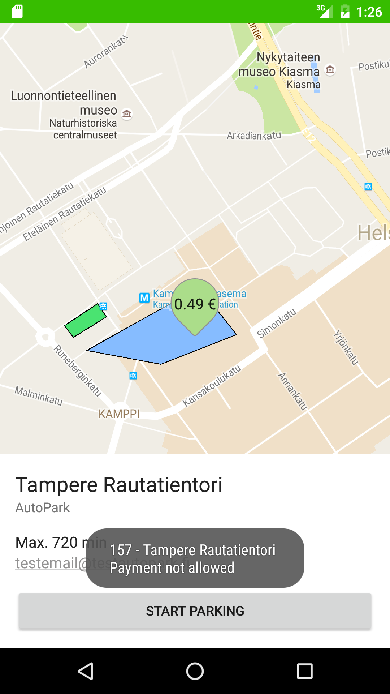

ParkMan Demo
============

The Android apk is available here : [parkman_demo.apk](./parkman_demo.apk)

Assignment
----------

> MAP INTERFACE FOR Android
> 
> 1. Summary
> 
>   - Single page application, Activity containing a full screen MapFragment
>   - Special note: For this task you need to obtain a Google Maps API key from Google
> 
> 2. Instructions
> 
>   - As an attachment in this email there is a JSON object that contains map data for hypothetical parking zones. This is dummy data snippet simulating a response received from the backend system. Handle the data like it was the result received from the backend.
> 
>   - Store/initialize the data in a way you feel is appropriate in this case. Among other things, each of the zones have a polygon object, that consists of latitude/longitude coordinate pairs which define the zone area.
> 
>   - Load the map view (with the viewport based on location_data.bounds)
>   - Draw the zone polygons (location_data.zones.polygon) on top of the map. Use the payment_is_allowed value for deciding the background color of the polygon.
>   - Draw a map pin in the center coordinate of the map. Customise the map pin so that it displays the service price for the selected zone at the center of the pin (selected zone is explained later on)
>   - Dragging/interacting the map changes the location of the map pin in a way, that once you stop touch gestures (e.g. dragging) on the map, the map pin always appears at the center coordinate of the map. While the map is being dragged, the pin should be hidden.
>   - Make a creative way of displaying other zone information (location_data.zones) for the currently selected zone. Currently selected zone is the one where the map pin (current location) is located (coordinate is within the zone polygon) and dragging the map pin into another zone should select this zone. Once a zone is selected, the background color of the zone polygon also changes.
>   - Place a start parking button (UIButton) as a part of your layout. Once tapped, the app will tell which zone is being parked.
> 
> The source code of the project can be put online (host it for example on BitBucket, Github, Dropbox etc.). Another option is to make a zip package of the files and send it to me. Feel free to ask if you have any questions.

Screenshots
-----------

 
 
 
